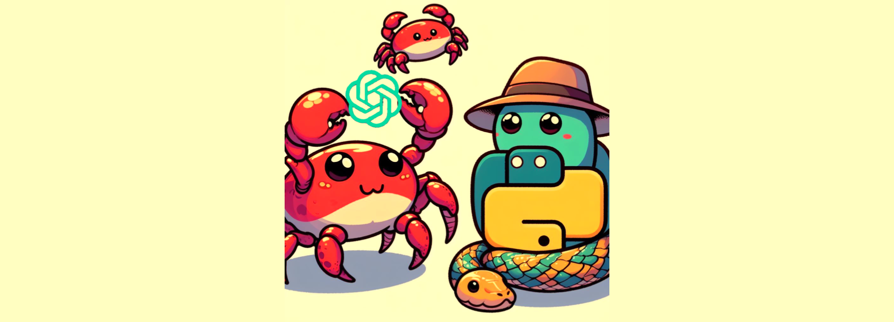

# RuPyGPT

    

ChatGPT character-level language modeling from scratch in Python and Rust: 

    

where `18, 47...` are integer encodings of characters, e.g. `18` encodes `F`, `47` encodes `i`.

## Python Requirements

- Python 3.12
- `pip install uv`
- `uv pip install torch numpy transformers datasets tiktoken wandb tqdm`

## References
- [Neural Network: Zero to Hero (Andrej Karpathy)](https://www.youtube.com/playlist?list=PLAqhIrjkxbuWI23v9cThsA9GvCAUhRvKZ)
- [NanoGPT](https://github.com/karpathy/nanoGPT)
